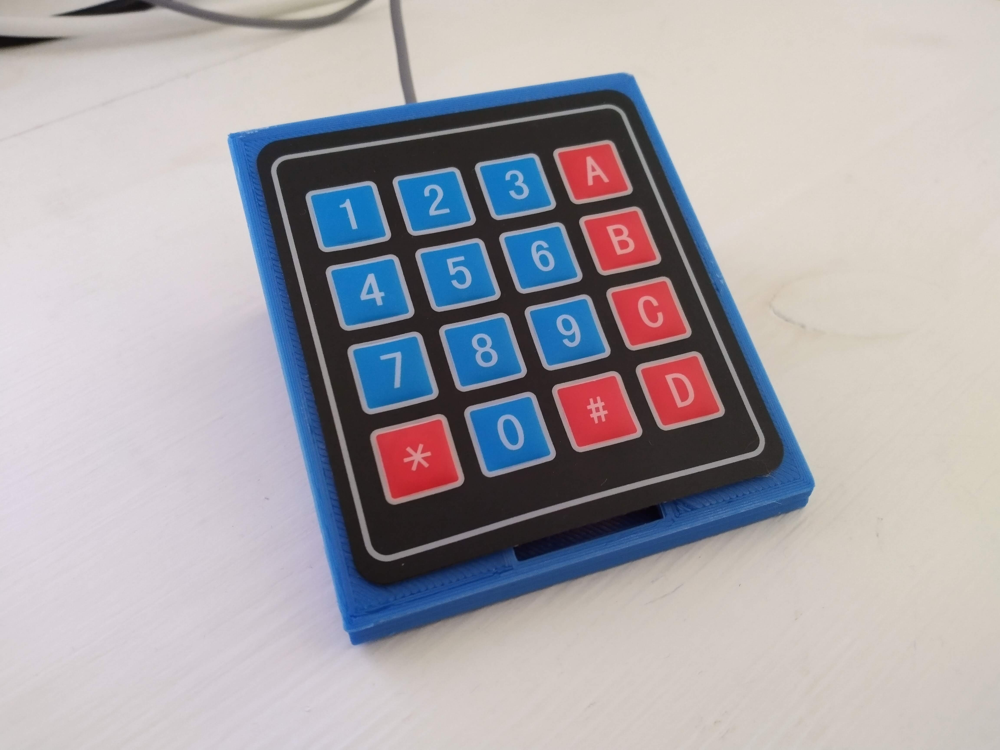
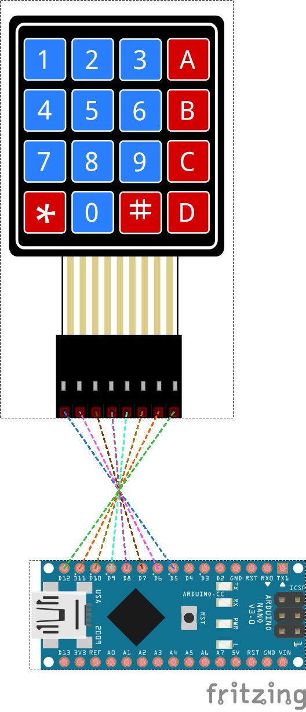

# Keypad

This is a small tool I made for my personal use.  
I decided to share it because I think it may be useful for others, feel free to use it and change it, respecing the [GPLv3 license](LICENSE).

Currently this works with a keypad built using an [Arduino Nano](https://www.arduino.cc/en/pmwiki.php?n=Main/ArduinoBoardNano) (the one pictured above) and can be used to send commands to [Open Broadcaster Software](https://obsproject.com/) using the [OBS websocket plugin](https://github.com/Palakis/obs-websocket) and generic keystrokes to whatever application happens to have keyboard focus, but the code is designed to be extensible and support other kinds of keypads and potentially other controlled applications.

Code for the application, Arduino device and design for a 3d printable enclosure are provided under the [GPLv3 license](LICENSE).

Multiple keypads may be connected to your machine, providing different commands from each device.  

## Features

Currently the application can be configured providing a configuration file in [YAML format](https://yaml.org/).  
You can get a better idea of the supported features by reading the [configuration guide](doc/configuration.md).

## Code

The main application is written in Go.  
Main reason for this is that I wanted to learn a new language, and Go seemed a good choice. I am not a very good student, so I prefer learning by doing, probably Go language experts out there have better solutions compared to my implementation, feel free to provide pull requests or comments.
As a side advantage the application should be quite portable and easy to distribute (single monolithic executable).  
I tested it only on Linux, but you should be able to build and run it also under Windows and MacOS.
For more information about this you may check [build instructions](go/build.md).
The [build instructions](go/build.md) document is useful also if you want to understand the code and maybe add some useful feature.

## Hardware

The currently supported keypad is built using very cheap and easy to source components (around 6€ for the keypad and Arduino Nano).  
It can be assembled easily and if you have access to a 3D printer you can print an enclosure that will make it easy to place on any desk.

The signals on the diagram are crossed because I soldered pins on the bottom of the Arduino Nano and I connected the keypad connector reversed to better fit inside the case. If you want to use different pins or reverse the connector, just check the rowPins and colPins declarations in the [Arduino Sketch](KeypadFW/KeypadFW.ino).  
The arduino code just detects a keypress and sends the matching character out on the serial port, just use the monitor integrate in the Arduino IDE to check if keys are returned correctly after you programmed the sketch on your device.

STL files for the two parts that made the case are available in the [arduino/stl](arduino/stl) subfolder. They have been designed with [tinkercad](https://tinkercad.com).

## TODO list

- add some testing code (I am lazy on this)
- try to use github actions to build code for the different platforms
- add an output device (showing current state of the keypad and the controlled app?)

